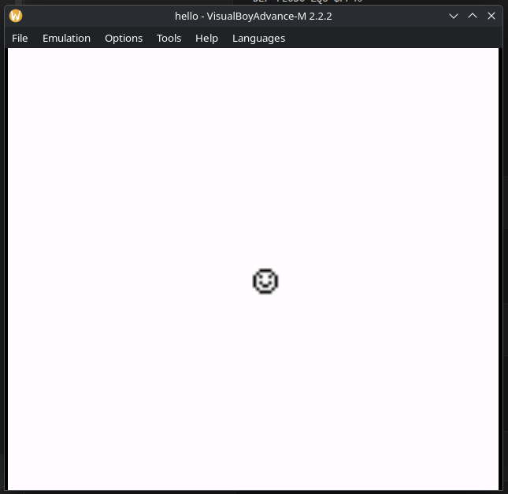

# Hello, World GameBoy Color Project

## Game Engine
This project is to create a simple engine and learn GBC processor instructions.

## Tooling
### Emulation
- BGB https://bgb.bircd.org/

### Coding
- RGBDS - https://rgbds.gbdev.io/

### Graphics
- ProMotion NG - https://www.cosmigo.com/
- rgbgfx
- Game Boy Tile Designer - https://www.devrs.com/gb/hmgd/gbtd.html

### Audio
- hUGETracker - https://nickfa.ro/wiki/hUGETracker
