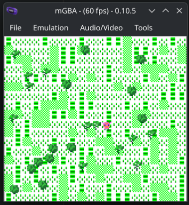

# GameBoy Color Projects

## Game Engine
This project is to create a simple engine and learn GBC processor instructions.

## Hello, World Learning Project

Check [/HELLO-WORLD/](HELLO-WORLD) folder.

## P1X GBC Engine 

Check [/P1X-GBC-ENGINE/](P1X-GBC-ENGINE) folder.

## Tooling
### Emulation
- BGB [bgb.bircd.org/](https://bgb.bircd.org)
- mGBA [mgba.io/](https://mgba.io)

### Coding
- RGBDS [rgbds.gbdev.io/](https://rgbds.gbdev.io)
- Zed Editor [zed.dev/](https://zed.dev)

### Graphics
- Game Boy Tile Designer [devrs.com/gb/hmgd/gbtd.html](https://devrs.com/gb/hmgd/gbtd.html)
- ProMotion NG [cosmigo.com/](https://cosmigo.com)
- rgbgfx

### Audio
- hUGETracker [nickfa.ro/wiki/hUGETracker](https://nickfa.ro/wiki/hUGETracker)
