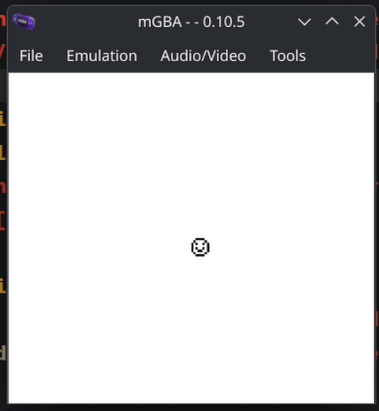

# GameBoy Color Projects

## Game Engine
This project is to create a simple engine and learn GBC processor instructions.

## Hello, World Learning Project

Check [/HelloWorld/](HelloWorld) folder.

## P1X GBC Engine 

Check [/P1X-GBC-ENGINE/](P1X-GBC-ENGINE) folder.

## Tooling
### Emulation
- BGB [https://bgb.bircd.org/](bgb.bircd.org)
- mGBA [https://mgba.io/](mgba.io)

### Coding
- RGBDS [https://rgbds.gbdev.io/](rgbds.gbdev.io)
- Zed Editor [https://zed.dev/](zed.dev)

### Graphics
- Game Boy Tile Designer [https://www.devrs.com/gb/hmgd/gbtd.html](devrs.com/gb/hmgd/gbtd.html)
- ProMotion NG [https://www.cosmigo.com/](cosmigo.com)
- rgbgfx

### Audio
- hUGETracker [https://nickfa.ro/wiki/hUGETracker](nickfa.ro/wiki/hUGETracker)
